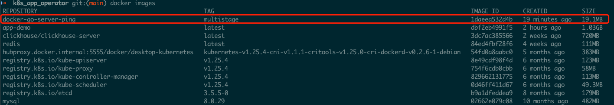

### 直接构建
docker build -t app-demo .                        # 1.03G  
docker run -d -p 8081:8081 --name test app-demo

普通版Dockerfile:
```cgo
## release: 1.03G alpine: 539MB
FROM golang:1.19-alpine

WORKDIR /app/
COPY . .

RUN go build main.go

EXPOSE 8080
ENTRYPOINT ["./main"]
```

### 优化镜像大小 
&nbsp; &nbsp; &nbsp; &nbsp; 镜像中还有全套的 Go 工具、Go 应用的依赖等，但实际我们应用运行时不需要这些文件，只需要编译后的二进制文件。那么能不能减小镜像的体积呢？

&nbsp; &nbsp; &nbsp; &nbsp; 要减小镜像体积，我们可以使用多阶段构建。Docker 在 17.05 版本以后，新增了多阶段构建功能。多阶段构建实际上是允许一个 Dockerfile 中出现多个 FROM 指令。通常我们使用多阶段构建时，会先使用一个（或多个）镜像来构建一些中间制品，然后再将中间制品放入另一个最新且更小的镜像中，这个最新的镜像就只包含最终需要的构建制品。

 

```cgo
docker build -t docker-go-server-ping:multistage -f Dockerfile.multistage .
docker run -d -p 8082:8081 --name multi docker-go-server-ping:multistage
```

多阶段Dockerfile
```cgo
# syntax=docker/dockerfile:1

############################## Build ##############################
FROM golang:1.19-alpine AS build

WORKDIR /app

COPY . .

# 使用交叉编译
RUN CGO_ENABLED=0 GOOS=linux go build -o docker-go-server-ping

############################## Deploy ##############################
FROM alpine:latest

WORKDIR /app/run

COPY --from=build /app/docker-go-server-ping docker-go-server-ping
COPY --from=build /app/conf conf

# 设置时区为上海
RUN ln -sf /usr/share/zoneinfo/Asia/Shanghai /etc/localtime
RUN echo 'Asia/Shanghai' >/etc/timezone

# 设置编码
ENV LANG C.UTF-8

# 暴露端口
EXPOSE 8081

ENTRYPOINT ["/app/run/docker-go-server-ping"]
```

### 参考文档
- https://zhuanlan.zhihu.com/p/382175578
- https://juejin.cn/post/7036752244162691103 